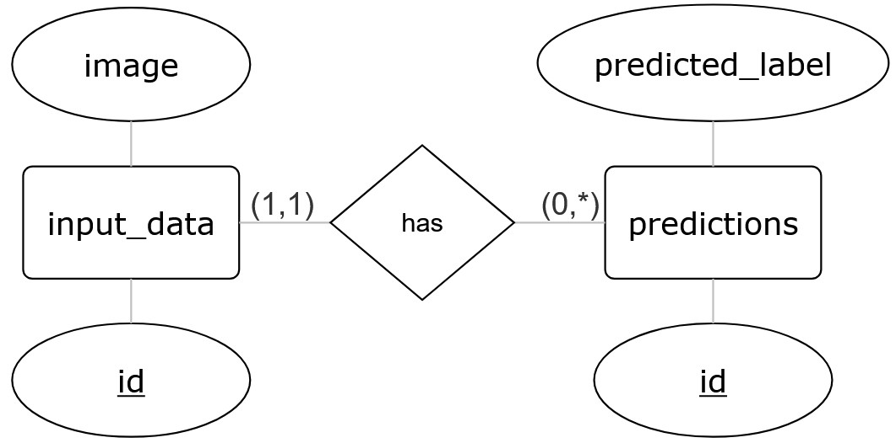

# Milestone 3 Report

## Task 1
If for Docker the Docker-Desktop app was installed, no installation of docker compose is necessary, since this service is included in the Docker-Desktop app.

### Necessary Services
The project introduced the getting-started[https://docs.docker.com/compose/gettingstarted/] documentation of Docker Compose uses two different services.
Docker Compose helps to control multiple services inside and between the containers. The Docker Compose file gives instructions about the services and containers. It furthermore contains configurations that are to be used for each of these services, such as which image to use, which ports are opened and how it communicates with other services.

**Web**
The Web service is a Docker container that runs a Flask application. Basically, the Web service runs the Docker image that is inside the directory and runs Flask. Flask creates a small web server inside the container. Flask listens for incoming requests of the webserver and responds based on the instructions written in the `app.py`

**Redis**
The second service is the Redis service. In the example Redis is used to retrieve the information for how often the user has opened the Website.

In Docker Compose every service gets gets a host name equal to its service name. This means that Docker Compose automatically creates a virtual network where all the containers can talk to each other using these names instead of IP-Addresses. This is possible because Docker has its own DNS-Resolver where the names are connected to the IP-Addresses of these services. This is great because even if the IP-Addresses change when the containers are recreated or someone else runs the docker compose file, since this could lead to different IP assigned to the containers. Using the hostname instead of IP addresses will ensure that the entire network will remain functional without manual configurations.

### Internal Ports
In Docker, each container has its own ports. These are usually separate from the host machine and are only visible inside Docker. This means that programs running inside a container cannot be reached from the host computer unless those ports are explicitly mapped or exposed through the Docker Compose configuration.

In the example from the "getting started" Redis runs on its default internal port 6379 inside the Redis container. This port is not exposed to the host machine because it is only meant to be accessed by other containers, not by the computer. So the The Flask application connects to Redis using the hostname redis (the service name) and port 6379.

However, not all services automatically listen on outside ports. If not defined, otherwise, Flask only accepts connections from inside its own container. Since Redis runs in its own separate container but Flask needs to be able to talk with Redis, Flask must accept communication with other containers, not just within its container. This is done with the following command inside the Dockerfile: `ENV FLASK_RUN_HOST=0.0.0.0`.
Furthermore, the Dockerfile specifies on which port to use in order to reach said container with the code `EXPOSE 5000`. This does not expose the port to the outside of the Docker network but it specifies the internal port of the container.

### External Ports
On the other hand, in the `compose.yaml` file the port of the web service are mapped in the following way: `8000:5000`. Inside the container, the port listens on port 5000 but it is made available to the outside on port 8000. So internally, other containers will still use the port 5000 to talk with the web service but if I want to visit the website with my computer (externally, since it is not in the local docker container network) the port 8000 must be used. Therefor the server can be reached by visiting `http://localhost:8000/` or `http://127.0.0.1:8000/` (with the IP of local host).

### Local Host
`localhost` is the hostname that is mapped to the own computer, it is basically the host name for the home IP address `127.0.0.1`. When opening the `http://localhost/` the browser is not connecting to the internet but to the own device.

This enables developers to test web servers and other applications locally and therefor eliminating the need exposing any ports to the internet. Moreover, as seen above, `localhost` works great with Docker since it allows to access containers through exposed ports.

The localhost also works from inside containers, since these act as "mini-computers". So when you are inside a docker container, the `localhost` refers to that container itself.

## 2 – PostgreSQL Setup and Basic Operations
### PostgreSQL
**What is SQL?**
SQL stands for "Structured Query Language" and is a standardized programming language used to manage and interact with data in relational databases. Relational databases store information in tables consisting of rows and columns, where each row represents a single data entry and each column represents a specific attribute of that data.

SQL is used to define database structures, modify stored data and retrieve information through queries. Essentially, it gives instructions to a Relational Database Management System (RDBMS) to perform operations such as creating tables, inserting or updating records, and extracting specific data.

Relational databases organize information in a structured format, making it fast and efficient to access. SQL follows formal standards that specify the correct syntax and usage, ensuring that SQL code is portable and interoperable across different database systems.

**What is PostgreSQL?**
PostgreSQL is an open-source relational database system known for its stability, flexibility, and adherence to SQL standards. It is widely used in applications that require scalability, reliability, and complex data handling.

A key feature of PostgreSQL is its support for ACID properties:
- Atomicity: Transactions are all-or-nothing
- Consistency: Data remains consistent after a transaction
- Isolation: Concurrent transactions do not interfere with each other
- Durability: Once committed, changes are permanent

PostgreSQL also allows the creation of custom data types and functions, making it suitable for projects that require specialized or complex data structures.

**SQL or NoSQL**
SQL databases are structured and schema-based, meaning that the data structure (tables, columns, and data types) must be defined before data is collected. This approach is ideal for situations where data consistency and transaction safety are important.
NoSQL databases, on the other hand, provide flexible data models. They can store data as key-value pairs, documents, graphs, or wide-column tables, depending on application requirements. This flexibility allows NoSQL databases to handle large volumes of diverse, semi-structured or unstructured data that may change frequently.

Although there is discussion about SQL vs. NoSQL approaches, PostgreSQL is fundamentally a relational database. It enforces schemas, stores structured data, and uses SQL for querying and data manipulation, making it a SQL (relational) database.

### PostgreSQL with Docker
We use the official PostgreSQL Docker image and customize it by exposing the standard PostgreSQL port and specifying the current version of PostgreSQL. The resulting command takes the following form:
`docker run --name postgres_name -p 5433:5432 -e POSTGRES_PASSWORD=mysecretpassword -d postgres:18.1`

Originally, both setups used port 5432. Since only one PostgreSQL container can bind to a specific port at a time, running the scripts from Task 2/3 and Task 4 would require stopping the currently running container and starting another one. This quickly becomes tedious so using different ports for the PostgreSQL containers avoids this issue and allows the scripts to be used more conveniently in parallel.

Check if the container is running with `docker ps` --> `STATUS` --> "Up ... seconds" or check the container status through the Docker desktop applicaiton.

For this project, we use Psycopg, the most popular PostgreSQL adapter for Python. We install this via the `requirements.txt` file in the virtual environment.

### Python Jokes
The code is divided into functions to improve modularity, readability, and reusability. Each function handles a specific task, making the code easier to understand and maintain.

It starts by connecting to the default PostgreSQL database, which is necessary because, without this step, we cannot create our own database. Environment variables are used for security and flexibility: sensitive information such as the database username and password is stored outside the code, and these variables can be modified from the command line without changing the code itself. 
After connecting, the code creates a new database. If a database with the chosen name already exists, nothing happens and it is not overwritten. Wrapping this logic in a function helps manage the limitation that PostgreSQL does not allow the use of `IF NOT EXISTS` for database creation. This approach is much easier to understand than, for example, using a `DO` block. The autocommit parameter ensures that commands are executed as individual transactions, which is required for PostgreSQL to handle database creation correctly.
Once the database is created, the code connects to it using the same procedure as the default database connection.
The table creation function is very similar, with the difference that `IF NOT EXISTS` can be used to prevent errors if the table already exists.
The joke insertion function prepares a container for the joke, which is then inserted into the table.
At the end, the code checks if an environment variable for the database name is set and provides a default if not. Finally, the functions are executed and our joke is printed.

This approach clearly organizes the workflow for inserting the joke, making the process intuitive and easy to follow.

### pgAdmin
**Initialize pgAdmin**
To initialize pgAdmin, we first pull the official pgAdmin image:
`docker pull dpage/pgadmin4`

Then we run the container:
`docker run --name pgadmin -p 5050:80 -e PGADMIN_DEFAULT_EMAIL=my@mail.com -e PGADMIN_DEFAULT_PASSWORD=mysecretpassword -d dpage/pgadmin4`.

Once the container is running, we can open a browser and navigate to localhost:5050, logging in with the credentials provided during setup. This gives access to the pgAdmin interface in the same way as the desktop application.

**Connect PostgreSQL Database**
To connect the PostgreSQL database in pgAdmin, we add a new server and fill out the following sections:

<ins>General<ins>
- Name: Choose any name to identify the server, for example `PostgreSQL DSTA`.
    
<ins>Connection<ins>
- Host name: Get the IP address of the PostgreSQL container using  
`docker inspect -f '{{range .NetworkSettings.Networks}}{{.IPAddress}}{{end}}' postgres_name`
It is important that the container name used in the command (`postgres_name`) matches the name specified when setting up the PostgreSQL container with Docker.
- Username: `postgres` (specified before)
- Password: The password set when creating the PostgreSQL container
- Save password: Enable this option to avoid entering the password every time

On the left-hand side of the pgAdmin interface, a drop-down menu appears under `Servers` → `PostgreSQL DSTA` → `Databases`. This list includes the two databases created earlier: the default `postgres` database and the `dsta_ms3` database. By navigating to `dsta_ms3` → `Schemas` → `Tables`, the `jokes` table (and later mnist) becomes visible. The stored data can be viewed by right-clicking on the `jokes` table and selecting `View/Edit Data`.

**Implications of Deleting the Container**
The PostgreSQL database runs inside a Docker container. The Python script connects to the database via a network connection using the specified host and port and executes SQL commands such as creating tables or inserting data. The actual database data is stored inside the container’s filesystem. If the container is stopped and deleted, all data stored within it is lost. Starting a new container therefore results in an empty database, requiring the Python script to reconnect and recreate the database structure and tables. This can be avoided by using a Docker volume, which stores the database data on the host machine. When a volume is used, the data persists even if the container itself is deleted and recreated.

## 3 -Handling Non-Textual Data in Relational Databases
### Data Transformation
To store images in PostgreSQL, the image data must be converted into binary format because relational databases are designed for structured data, not raw media files. PostgreSQL provides the `BYTEA` data type to store such binary data. When using Python, images are typically converted into bytes. These bytes can then be inserted directly into a `BYTEA` column like any other value.

When retrieving the image, the binary data is read from the database and converted back into an image object in Python. This process preserves the entire content of the image exactly as it was stored. Storing images as `BYTEA` ensures they can be saved, queried, and reconstructed correctly. Relational databases cannot interpret image formats, so this conversion is necessary.

### MNIST Data
The image data is stored as NumPy arrays, where each entry represents a single image. Each image is 28x28 pixels with a single channel indicating grayscale. The pixel values are normalized to fall between 0 and 1. Labels are represented as class vectors (called one-hot vectors), where the vector length equals the number of classes and a 1 marks the correct class.
To store these images in PostgreSQL, the data must be converted into binary format using the BYTEA type.

The database table for the MNIST data is relatively simple, with three main columns:

|<ins>imgID</ins>|Image|Label|
| -------- | ------- | ------- |
|serial|bytea|integer|

`imgID` represents the primary key of the table. The `serial` type is used to automatically generate unique identifiers, numbering each observation.
`Image` stores the image data as binary using the `BYTEA` type, allowing PostgreSQL to save the raw bytes of the images.
`Label` stores the corresponding label as an integer. Since MNIST labels represent classes from 0 to 9, integer is appropriate. It would also be possible to store the label as text instead of an integer if preferred.

When working with more complex image datasets, such as images of animals, additional attributes can make querying and analysis much easier. These may include categories or subclasses, as well as metadata such as image resolution, source, creation time, or the location where the image was taken. If information can be extracted directly from the image content, attributes like the number of legs, dominant color, or patterns could also be stored. While it is technically possible to include many attributes, it is generally better to limit the schema to information that is relevant for the specific use case in order to keep the database structure clear and manageable.

When working with more complex image datasets (e.g. animals), additional attributes like category, subclass, or other metadata describing the image content can be useful. Further attributes might include image resolution, the source of the image, the creation time, or the location where the picture was taken. If it is possible to extract information about the image content itself, attributes such as the number of legs, color, or pattern could also be stored. In principle, it is possible to include attributes for any type of information that can be extracted from an image. However, it is better to limit the table to attributes that are relevant for the specific use case, in order to avoid unnecessary complexity and maintain a clear and manageable database structure. 

### Implementation for MNIST
Due to the clear structure and the use of functions in the `database_jokes.py` code, the workflow for handling the MNIST data is very similar. Database creation, table creation, and data insertion follow the same principle.

The code uses a function to select an observation in random order, which ensures that a random image is chosen even if the stored observations are not ordered randomly.

Next, the MNIST dataset is loaded and prepared in the same way as in the previous milestones. As before, a small sample of 10 images is used. The code iterates over these samples, takes the images from the test dataset (using the training data would also be possible, as the data is not used further at this stage), and converts each image into bytes before storing it in the database.

Finally, all functions are executed, resulting in status messages and the label of the retrieved image being printed. The image itself is saved as a PNG file and should theoretically open automatically. However, this step did not work because no image viewer is installed on the Linux system. Since we are not supposed to install additional packages with sudo rights, the image cannot be opened directly. Nevertheless, because the image is saved, it is still possible to access the Linux folder from the Windows interface and open the file manually to verify that the process worked correctly.

## Taks 4
** Entity Relationship Diagram
